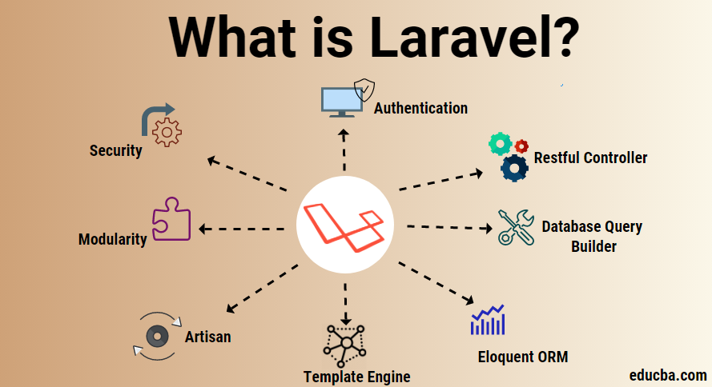
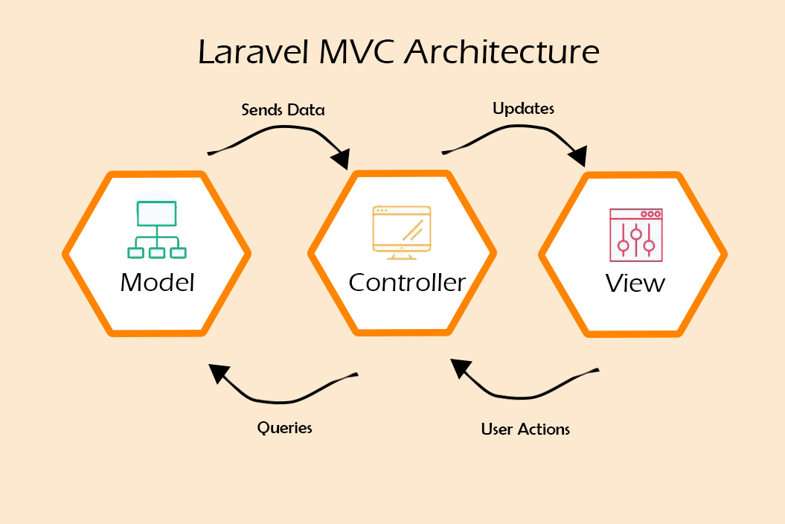

# LARAVEL-RESTAURANT

[![Youtube][youtube-shield]][youtube-url]
[![Facebook][facebook-shield]][facebook-url]
[![Instagram][instagram-shield]][instagram-url]
[![LinkedIn][linkedin-shield]][linkedin-url]

Thanks for visiting my GitHub account!

 **Laravel** is a free and open-source PHP- based web framework for building high-end web applications. It was created by Taylor Otwell and intended for the development of web applications following the model–view–controller architectural pattern and based on Symfony. [see-more](https://laravel.com/docs/)

|                                |
| :----------------------------: |
|  |

### [Code-Example](https://github.com/learnwithfair/laravel-restaurant)

## Source Code (Download)

- [Documentation](https://mega.nz/folder/RGFiUApD#PoKIVCwF8IkQhE2PHw1XxQ)
- [See-More](https://github.com/mnishihan/laravel-docs-in-pdf)

## Required Software (Download)

- VS Code, Download - ->https://code.visualstudio.com/download
- XAMPP ,Download- -> https://www.apachefriends.org/download.html
- Composer ,Download (Composer-Setup.exe)- -> https://getcomposer.org/download/
- Nodejs ,Download - -> https://nodejs.org/en/download

## Laravel Roadmap

|                                                 |                                                 |
| :---------------------------------------------: | :---------------------------------------------: |
|                Laravel Framework                |                MVC Architecture                 |
|  |  |

## Create Laravel Project

- Step-1: Run the command in the cmd

```cmd
composer create-project laravel/laravel projectName
or,
composer global require laravel/installer

laravel new projectName
```

Step-2: **Connect Database**

- In the .env file change the configuration as-

```cmd
DB_CONNECTION=mysql
DB_HOST=127.0.0.1
DB_PORT=3306
DB_DATABASE=DatabaseName
DB_USERNAME=root
DB_PASSWORD=
```

- For Send Mail

  - Create a Mailtrap account using path - -> https://mailtrap.io/
  - Get the username & password from Mailtrap account using path- ->https://mailtrap.io/inboxes/2087677/settings
  - Set up .env file as-

  ```cmd
  MAIL_MAILER=smtp
  MAIL_HOST=sandbox.smtp.mailtrap.io
  MAIL_PORT=2525
  MAIL_USERNAME=YourUserName
  MAIL_PASSWORD=YourPassword
  MAIL_ENCRYPTION=tls
  MAIL_FROM_ADDRESS="yourEmailAddress"
  MAIL_FROM_NAME="${APP_NAME}"
  ```

- Create data table write the command in cmd

```cmd
php artisan migrate
```

- Note: If it's not working correctly then following the s

  - Manually, Create the desired database in the path- -> `http://localhost/phpmyadmin/`
  - Or Create database using cmd as-

    - Set up the Environment variabel `C:\xampp\mysql\bin`
    - Write the command in the cmd

    ```cmd
    mysql -u root -p (password: Not Used)
    create database DatabaseName; (semicolon must be add in the end)
    show databases;
    exit;
    ```

    - Again run the command in the cmd as-

    ```cmd
    php artisan migrate
    ```

Step-3: **For Run Project**

- Start the Xampp server
- Run command in the root directory `php artisan serve`
- Run command (Another CMD) in the root directory `npm run dev` (Optional)
- Visit path - -> http://127.0.0.1:8000/

[See-more](https://laravel.com/docs/)

## Documentation

---

    				Laravel Tutorial

---

### 01. Required Software for Laravel Project

1. xampp
2. Composer.
3. node.js (For React js)
4. JSON Formatter Extension (For dd format)

### 02. Create Laravel Project

- => Command:

```cmd
composer create-project laravel/laravel project-name
           Or, laravel new project-name
```

- => For creating Registration and login in Laravel

```cmd
(i) composer require laravel/jetstream
(ii) php artisan jetstream:install livewire
```

- => For importing react js in Laravel

```cmd
(i) composer require laravel/ui
(ii) php artisan ui react / php artisan ui react --auth (with auth)
(iii) npm install
(iv) npm run dev
```

### 03. Start Laravel Project

- => Command: `php artisan serve`

### 04. Open Project by vs code

- => Command: `code .`

### 05. Check Version

- => Command:

```cmd
(i) php artisan --version (For Laravel)
(ii) php -v (For php)
(iii) composer -v (For composer)
(iv) node -v (For node.js)
```

### 06. Create Virtual Host:

1. Go to the `\xampp\apache\conf\extra\httpd-vhosts.conf` file

   - => Code:

   ```cmd
   1.<VirtualHost \*:80>
    DocumentRoot "project path"
   ServerName hostName (Ex-laravel.com)
   </VirtualHost>
   ```

2. Go to the `C:\Windows\System32\drivers\etc\hosts` file

   - => Code:

   ```cmd
   127.0.0.1 hostName (Edit with run as administrator)
   ```

### 07. File Placement

1.  CSS, JS, Image place in the `public` folder.
2.  php file store in the `Resources/View` folder.
3.  Controller file place in the `app/Http/Controllers` folder.

- => FileName: Example of controlelr name `CategoryController`.
- => Used: Controller file used for `Route control`.
- => Code: `get/put/update/delete` etc method create.
- => Command:
- `php artisan make:controller ControllerName` (With Manually).
- `php artisan make:controller ControllerName invokable` (With 1 method).
- `php artisan make:controller ControllerName --resource` (With 7 method).

4.  Request file place in the `app/Http/Requests` folder.

- => FileName: Example of Request file name CategoryController
- => Used: Request file mainly used for form validation.
- => Code: public function{return true;}
  and use function rules(For set requirement/required),
  messages(For set custom message),attributes(For change default value).
- => Command: `php artisan make:request RequestName`.

5.  Model file place in the `app/Http/Models` folder.

    - => FileName: Example of Model file name Category.(usualy single and singular).
    - => Used: Model file mainly used for connect database.
    - => Code: should be used "protected $fillable = ['name','description',...];"
    - => Command: `php artisan make:model ModelName`.

6.  Migration file place in the `database/migrations` folder.

    - => FileName: Example of Model file name create*file_name_table.(used small letter and separate by *).
    - => Used: Model file mainly used for create data table.
    - => Code: use nullable() property.
    - => Command: `php artisan make:migration create_file_name_table`.

7.  Combine Command For `Model, Migration & Controller` with resource.

    - => Command: `php artisan make:model ModelName -mcr`

8.  Route documents place in the `routes/web.php` File.

    - => Used: Route file mainly used for move one page to another page.
    - => Code: Route::get( '/', function () { return view( 'welcome' ); } );
      - Route::get( 'url/{id,name}', [ControllerName::class, 'functionName'] ); (Using controller and (id, name) is passing value by url ).
      - Route::resource( 'url', ControllerName::class ); (Resource automatically call function).
      - Route::get( 'url/{id,name}', [ControllerName::class, 'functionName'] )- ->name('folder.fileName');(For Name Route)
      - Route::prefix('prefixText')- ->controller(ControllerName::class)- ->group(function(){Route::get('url','functionName')});(For prefix and Grouping Route)
    - => Method: get/post(for form submit)/PUT(For Update)/PATCH/DELETE(For Delete).
    - => Command: `php artisan route:list`

9.  Component & slot file place in the `resource/view/components` folder.

    - => FileName: Example of components file name header.blade.php.(used small letter and separate by \_).
    - => Used: Component file mainly used for reuseable code.
    - => Code:
    - -> **Option -01**

```php
 <h3>This code place in the component file.</h3>
 <x-fileName></x-fileName>(For display)
 - -> **Option -02** (default component with value passing)
 <h3>{{ $slot }}</h3> This code place in the component file.
 <x-fileName></x-fileName>.(For display)
 - -> **Option -03** (Name componet with value passing)
 <h3>{{ $componentName }}</h3> This code place in the component file.
 <x-fileName:componentName></x-fileName>.(For display)

```

- => Command: `php artisan make:component file_name`.

10. Custom error page place in the `resource/view/errors` folder.

- -> **Option -01**

- => FileName: Example of error page name `404.blade.php`
  - -> **Option -02** (All errors page automatically created)
- => Command: `php artisan vendor:publish --tag=laravel-errors`

11. Extra Component such as- (Illuminate database, fakerphp, phroute, database seeder).

### 08. For database create.

- => Command: (using cmd)

```cmd
(i) Set up Environment variabel `C:\xampp\mysql\bin`
(ii) mysql -u root -p (password: Not Used)
(iii) create database restaurant;
(iv) show databases;
(v) exit;
```

### 09. For data table create.

- => Command: `php artisan migrate`
  - `php artisan migrate:rollback` (For delete column/data table from database)

### 10. For connect database go to .env file

- => Code: `DB_DATABASE=database_name`

### 11. Insert data using cmd

- => Command:

```php
  (i) php artisan tinker
  (ii) DB::table('tableName')- ->insert(["name"=>"MD RAHATUL RABBI","email" =>"rahatul@gmail.com","password"=>bcrypt("rahatul")]);(For Insert values in the data table)
  (iii) DB::table('tableName') ->get(); (For Display)
  (iv) exit()
```

### 12. File extention

1. For raw php file use .php extention.
2. For laravel php file use `.blade.php` extention. write code with `{{ }}`
3. layout file name start with `_` line. Ex- `_master.blade.php`

### 13 Code

---

    				Code

---

1. For `Form`

   - => Code:

```php
   (i) @csrf
   (ii) @method('DELETE/PUT') (For delete or Update)
   (iii) bcrypt('password'); (For secure password like as md5())
   (iv) CKEDITOR, Summernote
   (v) $image = $request ->slider_img;
 $imageName = time() . '.' . $image ->getClientOriginalExtension();
 $request->slider_img ->move( 'uploads/slider', $imageName );
 $data['image'] = $imageName;
```

2. For `Insert/Show/Update/Edit/Delete` using Model

   - => Code: (For Display ) ----------------------------------------------
     dd( $request- ->all() ); (For check data)

   - -> Option -01

   ```php
    $data['categories'] = ModelName::all();
    return view( 'folderName.fileName', $data );
   ```

   - -> Option -02

   ```php
    $categories = ModelName::all();
    return view( 'folderName.fileName', ['categories'  => $categories] );
   ```

   - -> Option -03

   ```php
     $categories =ModelName::all();
     return view( 'folderName.fileName', compact( 'categories' ) );
   ```

   - => Code: (For Store) ------------------------------------------------

     name and description are input's name in the form

   - -> Option -01

   ```php
     $data['tableColumnName'] = $request ->name;
     $data['tableColumnName'] = $request ->description;
     ModelName::create( $data );
    return back();
   ```

   - -> Option -02

   ```php
     ModelName::create( [
     'tableColumnName'  => $request ->name,
     'tableColumnName'  => $request ->description,
     ] );
   ```

   - => Code: (For display single data) ------------------------------------------------

     - -> Option -01

     ```php
      $data['category'] = $parameterName;
      return view( 'folderName.fileName', $data );
     ```

   - -> Option -02

   ```php
    return view( 'folderName.fileName', ['category'  => $parameterName] );
   ```

   - -> Option -03

   ```php
    return view( 'folderName.fileName', compact( 'parameterName' ) );
   ```

   - => Code: (For display Edit Fill data) ------------------------------------------------

     - -> Option -01

   ```php
      $data['category'] = $parameterName;
      return view( 'folderName.fileName', $data );
   ```

   - -> Option -02

   ```php
    return view( 'folderName.fileName', ['category'  => $parameterName] );
   ```

   - -> Option -03

   ```php
    return view( 'folderName.fileName', compact( 'parameterName' ) );
   ```

   - => Code: (For Update data) ------------------------------------------------
     name and description are input's name in the form

   - -> Option -01

   ```php
    $data['tableColumnName'] = $request ->name;
    $data['tableColumnName'] = $request ->description;
    $parameterName ->update( $data );
    return redirect() ->route( 'folderName.fileName' );
   ```

   - -> Option -02

   ```php
    $parameterName ->update( [
    'tableColumnName'  => $request ->name,
    'tableColumnName'  => $request ->description,
    ] );
    return redirect()- ->route( 'folderName.fileName' );
   ```

   - -> Option -03

   ```php
    ModelName::where( 'id', $parameterName- ->id ) ->update( [
    'tableColumnName'  => $request ->name,
    'tableColumnName'  => $request ->description,
    ] );
   ```

   - => Code: (For Delete data) ------------------------------------------------

   ```php
    $parameterName- ->delete();
   ```

3. For `Insert/Show/Update/Edit/Delete` using DB

   - => Code: (For Display ) ----------------------------------------------
     `dd( $request- ->all() );` (For check data)
   - -> Option -01

   ```php
    $data['categories'] = DB::table( 'TableName' ) ->get();
    return view( 'folderName.fileName', $data );
   ```

   - -> Option -02

   ```php
    $categories = DB::table( 'TableName' ) ->get();
    return view( 'folderName.fileName', ['categories'  => $categories] );
   ```

   - -> Option -03

   ```php
     $variableName = DB::table( 'TableName' ) ->get();
     return view( 'folderName.fileName', compact( 'variableName' ) );
   ```

   - => Code: (For Store) ------------------------------------------------
     name and description are input's name in the form

     - -> Option -01

     ```php
      $data['tableColumnName'] = $request ->name;
      $data['tableColumnName'] = $request ->description;
      DB::table( 'TableName' ) ->insert( $data );
      return back();
     ```

   - -> Option -02

   ```php
    DB::table( 'TableName' ) ->insert([
    'tableColumnName'  => $request->name,
    'tableColumnName' => $request ->description,
    ] );
   ```

   - => Code: (For display single data) ------------------------------------------------

     - -> Option -01

     ```php
      $data['category'] = DB::table( 'TableName' ) ->where( 'id', $id ) ->first();
      return view( 'folderName.fileName', $data );
     ```

   - -> Option -02

   ```php
    return view( 'folderName.fileName', ['category'  => DB::table( 'TableName' ) ->where( 'id', $id )->first()] );
   ```

   - -> Option -03

   ```php
    $variableName['category'] = DB::table( 'TableName' )->where( 'id', $id ) ->first();
    return view( 'folderName.fileName', compact( 'variableName' ) );
   ```

   - => Code: (For display Edit Fill data) ------------------------------------------------
     - -> Option -01
     ```php
      $data['category'] = DB::table( 'TableName' ) ->where( 'id', $id ) ->first();
      return view( 'folderName.fileName', $data );
     ```
   - -> Option -02

   ```php
    return view( 'folderName.fileName', ['category'  => DB::table( 'TableName' ) ->where( 'id', $id )->first();] );
   ```

   - -> Option -03

   ```php
    $variableName['category'] = DB::table( 'TableName' ) ->where( 'id', $id ) ->first();
    return view( 'folderName.fileName', compact( 'variableName' ) );
   ```

   - => Code: (For Update data) ------------------------------------------------
     name and description are input's name in the form

     - -> Option -01

     ```php
      $data['tableColumnName'] = $request ->name;
      $data['tableColumnName'] = $request ->description;
      DB::table( 'TableName' ) ->where( 'id', $id ) ->update( $data );
      return redirect() ->route( 'folderName.fileName' );
     ```

   - -> Option -02

   ```php
    DB::table( 'TableName' ) ->where( 'id', $id ) ->update( [
    'tableColumnName'  => $request ->name,
    'tableColumnName'  => $request ->description,
    ] );
   ```

   - => Code: (For Delete data) ------------------------------------------------

     `DB::table( 'TableName' ) ->where( 'id', $id ) ->delete();`

### 14. Form Validation

- => Code: ------------------------------------------------

  - -> Option -01
    Form validation

    ```php
    $request- ->validate( [
    'inputName'  => 'required|max:255',
    'inputName'  => 'required',
    ], [
    'inputName.required'  => "Name must be filled up!",
    'inputName.required'  => "Description filled must be required!",
    ] );
    ```

  - -> Option -02 (Using Class)
    ```php
          public function store( CategoryFormRequest $request ){
               $request ->validated();
           }
    ```

In the request class that place in the `app/http/Requests` initialized function as-
`authorize(return true),rules(set required condition),messages(set custom message),attributes(change default message)`

- => Display message: ------------------------------------------------

```php
 @error('name')
 {{ $message }}
 @enderror
```

### 15. Set/get session/ alert

- => Code: (For set) ------------------------------------------------

  - -> Option -01

  ```php
   session() ->flash( 'success', "Messages" );
   return redirect() ->route( 'folderName.fileName' );
  ```

  - -> Option -02

  ```php
             Session::flash( 'warning', "Messages" );
             return redirect() ->route( 'folderName.fileName' );
  ```

  - -> Option -03
    ```php
          return redirect() ->route( 'folderName.fileName' ) ->with( 'success', "danger" );
    ```

- => Code: (For get) ------------------------------------------------
  - -> Option -01
  ```php
   @if (session('success'))
   {{ session('success') }}
   @endif
  ```
  - -> Option -02
  ```php
   @if (session()- ->has('success'))
   {{ session()- ->get('success') }}
   @endif
  ```
  - -> Option -03
  ```php
   @if (Session::has('success'))
   {{ session()- ->get('success') }}
   @endif
  ```
  - -> Option -04 (For together print)

```php
    @foreach ($errors- ->all() as $error )
<li>{{ $error }}</li>
@endforeach
```

### 16. Method of Laravel

- (i) @include('folderName.fileName') (Full page include without @yield)
- (ii) @extends('folderName.fileName') (Full page include with @yield)
- (iii) @yield('title')
- (iv) @section('title') @endsection
- (v) route('folderName.fileName') (For URL)
- (vi) asset('path') (For css/js/image link)

### 17. Conditional statment and loop in Laravel

- (i) @if ........@endif
- (ii) @foreach (variableName that through in the Control file as $valiableName) -- $valiableName- ->keyName --- @endforeach

### 18. cache clear

- -> Option -01 (For Localhost)

- => Command: `php artisan optimize:clear`

- -> Option -02 (For Live Server)

- => Code: (Place in the web.php file)------------------------------------------------
  ```php
  Route::get( '/clear', function () {
  Artisan::call( 'optimize:clear' );
  return "
  events ..... DONE </br>
  views .......DONE </br>
  cache ...... DONE </br>
  route .......DONE </br>
  config ......DONE </br>
  compiled ....DONE </br>
  ";
  } );
  ```

## VS code Extention

- Laravel Blade Snippets
- Laravel Snippets
- Laravel Artisan
- Laravel goto view
- Laravel Extra intellisense
- Laravel goto components
- Laravel Blade spacer
- php debug
- php Namespace
- phpcs
- php DocBlocker
- PHPDoc Comment
- database client
- Community material theme
- VS code great icon
- code Runner
- Code Spell checker
- Auto import
- Beautify
- gettter & setter generator
- Mithrill Emmet

## VS Code json file

```json
{
  "workbench.colorTheme": "Default High Contrast",
  "files.autoSave": "onFocusChange",
  "LaravelExtraIntellisense.basePathForCode": "\"LaravelExtraIntellisense.customValidationRules\": {     \"mobile\": \"mobile\",     \"distance_gt\": \"distance_gt:${0:1km}\" }",
  "vsicons.dontShowNewVersionMessage": true,
  "phpfmt.php_bin": "\"E:\\phpproject\\php\\php.exe\"",
  // "phpfmt.php_bin": "\"C:\\Program Files\\php\\php.exe\"",
  "[php]": {
    "editor.formatOnSave": true,
    "editor.defaultFormatter": "kokororin.vscode-phpfmt"
  },
  "phpfmt.passes": [
    "PSR2KeywordsLowerCase",
    "PSR2LnAfterNamespace",
    "PSR2CurlyOpenNextLine",
    "PSR2ModifierVisibilityStaticOrder",
    "PSR2SingleEmptyLineAndStripClosingTag",
    "ReindentSwitchBlocks",
    "AddMissingParentheses",
    "AlignDoubleArrow",
    "AlignDoubleSlashComments",
    "AlignEquals",
    "AlignGroupDoubleArrow",
    "AlignPHPCode",
    "SpaceBetweenMethods",
    "SpaceAroundParentheses"
  ],
  "phpfmt.exclude": [
    "ReindentComments",
    "StripNewlineWithinClassBody",
    "AllmanStyleBraces"
  ],
  "phpfmt.psr2": false,
  "php.validate.executablePath": "",
  "php.debug.executablePath": "\"C:\\Program Files\\php\\php.exe\"",
  "workbench.iconTheme": "vscode-great-icons",
  "editor.formatOnSave": true
}
```

## Follow Me

[](https://github.com/learnwithfair) [](https://www.facebook.com/learnwithfair/) [](https://www.instagram.com/learnwithfair/) [](https://www.twiter.com/learnwithfair/) [](https://www.youtube.com/@learnwithfair)

<!-- MARKDOWN LINKS & IMAGES -- ->

[youtube-shield]: https://img.shields.io/badge/-Youtube-black.svg?style=flat-square&logo=youtube&color=555&logoColor=white
[youtube-url]: https://youtube.com/@learnwithfair
[facebook-shield]: https://img.shields.io/badge/-Facebook-black.svg?style=flat-square&logo=facebook&color=555&logoColor=white
[facebook-url]: https://facebook.com/learnwithfair
[instagram-shield]: https://img.shields.io/badge/-Instagram-black.svg?style=flat-square&logo=instagram&color=555&logoColor=white
[instagram-url]: https://instagram.com/learnwithfair
[linkedin-shield]: https://img.shields.io/badge/-LinkedIn-black.svg?style=flat-square&logo=linkedin&colorB=555
[linkedin-url]: https://linkedin.com/company/learnwithfair
````
